# 🎤 Agentic AI-Based Voice-Based Site Customizer

**📌 Project Title:** Agentic AI-Based Voice-Based Site Customizer  
**👤 Participant:** Nithish Kumar S L (PF-2)  
**🏆 Event:** Agentic AI Workshop - Final Hackathon Project

---

## 🧠 Project Overview

The **Agentic AI-Based Voice-Based Site Customizer** is a revolutionary multi-agent, LLM-powered system that enables users to create and customize websites through natural voice commands. This intelligent platform leverages advanced AI agents working in harmony to transform spoken instructions into dynamic website modifications in real-time.

### ✨ Key Features
- 🎙️ **Voice-First Interface** - Natural speech-to-website generation
- 🤖 **Multi-Agent Architecture** - 5 specialized AI agents working collaboratively
- 🔄 **Real-Time Updates** - Instant website modifications and live preview
- 🧠 **RAG-Enhanced Intelligence** - Context-aware design suggestions
- 🎨 **Professional UI** - Modern chatbot-style interface with IDE-like controls
- 💾 **Session Management** - Save, load, and manage multiple projects
- 🔍 **Intelligent Validation** - Ensures design best practices and user intent alignment

---

## 🏗️ System Architecture

### 🎯 Unified Architecture Overview

```mermaid
graph TB
    subgraph "🌐 Frontend Layer (Next.js)"
        A[🎤 Voice Input Interface]
        B[📱 React Components]
        C[💡 Custom Hooks]
        D[🖥️ Website Editor]
        E[📊 Session Management]
    end
    
    subgraph "🔗 Communication Layer"
        F[🌐 REST APIs]
        G[⚡ WebSocket]
        H[🔄 Real-time Sync]
    end
    
    subgraph "🎛️ Backend Layer (FastAPI)"
        I[🎙️ Voice-to-Text Agent]
        J[🧭 Semantic Intent Router]
        K[✏️ Contextual Editor Agent]
        L[📚 RAG-Enabled Response Agent]
        M[✅ Validation Agent]
    end
    
    subgraph "💾 Data Layer"
        N[📊 ChromaDB Vector Store]
        O[💾 Session Storage]
        P[📁 File System]
        Q[🧠 Memory Module]
    end
    
    subgraph "🤖 AI Services"
        R[🤖 Gemini Pro API]
        S[🎯 Web Speech API]
        T[🔍 Vector Embeddings]
    end
    
    A --> F
    B --> G
    D --> H
    E --> F
    
    F --> I
    G --> J
    H --> K
    
    I --> R
    I --> S
    J --> R
    K --> R
    L --> R
    L --> N
    M --> R
    
    I --> Q
    J --> Q
    K --> Q
    L --> Q
    M --> Q
    
    K --> O
    K --> P
    L --> N
    M --> O
    
    N --> T
    O --> P
```



### 🎨 Technology Stack

#### **Frontend Stack**
- **Framework:** Next.js 14 with TypeScript
- **Styling:** Tailwind CSS
- **Voice Processing:** Web Speech API
- **State Management:** React Hooks + Session Storage
- **Build Tool:** Webpack (via Next.js)

#### **Backend Stack**
- **Framework:** FastAPI with Python 3.11
- **AI Integration:** Google Gemini Pro API
- **Vector Database:** ChromaDB
- **Agent Framework:** Custom LangChain Implementation
- **Server:** Uvicorn ASGI

#### **AI & ML Components**
- **LLM:** Google Gemini Pro
- **Voice Recognition:** Web Speech API / OpenAI Whisper
- **Vector Embeddings:** Sentence Transformers
- **Knowledge Base:** RAG with ChromaDB

---

## 🔁 Agentic Workflow

### 🎯 Core Agents Overview

```mermaid
graph TD
    A[🎤 User Voice Input] --> B[Voice-to-Text Agent]
    B --> C[Semantic Intent Router Agent]
    C --> D[Contextual Editor Agent]
    C --> E[RAG-Enabled Response Agent]
    D --> F[Validation Agent]
    E --> F
    F --> G[🌐 Updated Website]
    
    H[📚 Knowledge Base] --> E
    I[🧠 Memory Module] --> C
    I --> D
    I --> E
```



### 🔍 Detailed Agent Descriptions

#### 1. 🎙️ Voice-to-Text Agent
**Primary Role:** Speech Recognition & Processing
- Converts user speech into structured text using Web Speech API
- Handles multiple languages and accents
- Filters background noise and normalizes audio input
- Provides real-time transcription with interim results
- **Technology Stack:** Web Speech API, OpenAI Whisper (fallback)

#### 2. 🧭 Semantic Intent Router Agent
**Primary Role:** Intent Analysis & Routing
- Analyzes transcribed voice commands using NLP
- Determines user intent (layout changes, styling, content modifications)
- Routes commands to appropriate specialized agents
- Maintains conversation context and user preferences
- **Technology Stack:** Gemini Pro API, Custom NLP models

#### 3. ✏️ Contextual Editor Agent
**Primary Role:** Website Modification & Editing
- Executes site layout and component modifications
- Handles text, color, layout, and structural changes
- Maintains HTML/CSS integrity during edits
- Implements responsive design principles
- **Technology Stack:** Gemini Pro API, Custom HTML/CSS processors

#### 4. 📚 RAG-Enabled Response Agent
**Primary Role:** Knowledge Retrieval & Enhancement
- Uses Retrieval-Augmented Generation for design suggestions
- Fetches relevant code snippets from knowledge base
- Provides contextual recommendations and alternatives
- Enhances responses with best practices and examples
- **Technology Stack:** ChromaDB, Vector embeddings, Gemini Pro API

#### 5. ✅ Validation Agent
**Primary Role:** Quality Assurance & Compliance
- Validates final customizations against user intent
- Ensures design best practices and accessibility standards
- Performs code quality checks and optimization
- Provides feedback and suggestions for improvements
- **Technology Stack:** Custom validation rules, Gemini Pro API

---

## 🎛️ Agent Design & Communication

### 🎛️ Centralized Orchestration
```python
# Agent Coordinator Architecture
class AgentCoordinator:
    def __init__(self):
        self.voice_agent = VoiceToTextAgent()
        self.router_agent = SemanticIntentRouter()
        self.editor_agent = ContextualEditor()
        self.rag_agent = RAGEnabledResponse()
        self.validator_agent = ValidationAgent()
        self.memory = SessionMemoryModule()
    
    async def process_voice_command(self, audio_input):
        # Orchestrated workflow
        text = await self.voice_agent.transcribe(audio_input)
        intent = await self.router_agent.analyze(text, self.memory)
        modifications = await self.editor_agent.edit(intent)
        enhanced_response = await self.rag_agent.enhance(modifications)
        validated_result = await self.validator_agent.validate(enhanced_response)
        return validated_result
```

### 🧠 Memory & Context Management
- **Session Persistence:** Maintains user preferences and conversation history
- **Context Windows:** Preserves recent interactions for coherent responses
- **User Profiling:** Learns from user patterns and preferences
- **Undo/Redo System:** Tracks all modifications for easy reversal

### 🔗 API Communication Layer
- **RESTful APIs:** Clean endpoints for each agent's functionality
- **WebSocket Support:** Real-time communication for live updates
- **Event-Driven Architecture:** Asynchronous processing for optimal performance
- **Error Handling:** Comprehensive error recovery and fallback mechanisms

---

## 💡 LLMs and Tools Used

### 🤖 Large Language Models

#### **Gemini Pro API**
- **Primary Use:** Design intent interpretation and code generation
- **Capabilities:** Natural language understanding, HTML/CSS generation
- **Integration:** Core reasoning engine for all agents

#### **Web Speech API / OpenAI Whisper**
- **Primary Use:** Speech-to-text processing
- **Capabilities:** Real-time voice recognition, multiple language support
- **Integration:** Voice input processing with fallback mechanisms

### 🛠️ Technology Stack

#### **Frontend (Next.js)**
```typescript
// Key Technologies
- Next.js 14 (React Framework)
- TypeScript (Type Safety)
- Tailwind CSS (Styling)
- Web Speech API (Voice Recognition)
- Custom React Hooks (Voice & Storage)
```

#### **Backend (Python FastAPI)**
```python
# Core Dependencies
- FastAPI (Modern Web Framework)
- LangChain (Agent Orchestration)
- ChromaDB (Vector Database)
- Pydantic (Data Validation)
- Uvicorn (ASGI Server)
```

#### **AI & ML Stack**
- **Vector Database:** ChromaDB for semantic search and RAG
- **Embeddings:** Sentence transformers for text vectorization
- **LLM Integration:** Google Gemini API for natural language processing
- **Agent Framework:** Custom LangChain-based orchestration

---

## 🚀 Scalability & Deployment

### 📈 Scalable Architecture
- **Microservices Design:** Each agent can be deployed independently
- **Horizontal Scaling:** Support for multiple concurrent users
- **Load Balancing:** Distributed processing across multiple instances
- **Caching Layer:** Redis for session and response caching

### 🐳 Containerization
```dockerfile
# Docker Configuration
FROM python:3.11-slim
WORKDIR /app
COPY requirements.txt .
RUN pip install -r requirements.txt
COPY . .
EXPOSE 8000
CMD ["uvicorn", "main:app", "--host", "0.0.0.0", "--port", "8000"]
```

### ☁️ Cloud Deployment
- **Frontend:** Vercel/Netlify for static site hosting
- **Backend:** AWS/GCP/Azure for API services
- **Database:** Managed vector database services
- **CDN:** Global content delivery for optimal performance

---

## 📂 Repository Structure

```
Day-10/Final Hackathon/
├── 📁 frontend/                    # Next.js Frontend Application
│   ├── 📁 src/
│   │   ├── 📁 app/                 # Next.js App Router
│   │   │   ├── page.tsx            # Home/Generator Page
│   │   │   ├── editor/
│   │   │   │   └── page.tsx        # Website Editor Interface
│   │   │   ├── layout.tsx          # Root Layout
│   │   │   └── globals.css         # Global Styles
│   │   ├── 📁 components/          # React Components
│   │   │   ├── VoiceButton.tsx     # Voice Recognition Button
│   │   │   ├── IntelligentResponse.tsx # AI Response Component
│   │   │   └── ClientOnly.tsx      # Client-side Only Wrapper
│   │   ├── 📁 hooks/               # Custom React Hooks
│   │   │   ├── useVoiceRecognition.ts # Voice Recognition Hook
│   │   │   └── useSessionStorage.ts   # Session Management Hook
│   │   └── 📁 services/            # API Integration
│   │       └── api.ts              # Backend API Client
│   ├── package.json                # Node.js Dependencies
│   ├── next.config.ts              # Next.js Configuration
│   ├── tailwind.config.ts          # Tailwind CSS Config
│   └── .env.local.example          # Environment Variables Template
│
├── 📁 backend/                     # Python FastAPI Backend
│   ├── main.py                     # FastAPI Application Entry Point
│   ├── 📁 services/                # Business Logic Services
│   │   ├── __init__.py
│   │   ├── website_generator.py    # Website Generation Service
│   │   ├── html_editor.py          # HTML/CSS Editing Service
│   │   ├── intelligent_response.py # AI Response Processing
│   │   ├── session_manager.py      # Session Management
│   │   ├── rag_service.py          # RAG Implementation
│   │   └── vector_store.py         # Vector Database Interface
│   ├── 📁 core/                    # Core Configuration
│   │   ├── __init__.py
│   │   └── config.py               # Application Configuration
│   ├── 📁 chroma_db/               # Vector Database Storage
│   ├── 📁 user_files/              # Generated Website Files
│   ├── requirements.txt            # Python Dependencies
│   ├── requirements_simple.txt     # Simplified Dependencies
│   ├── .env_example                # Environment Variables Template
│   └── start_server.py             # Development Server Launcher
│
├── 📁 assets/                      # Documentation Assets
│   ├── agentic-flow-diagram.png    # Agent Workflow Diagram
│   ├── technical-architecture.png  # System Architecture
│   └── ui-screenshots/             # Application Screenshots
│
├── .gitignore                      # Git Ignore Rules
└── README.md                       # This File
```

---

## 🚀 How to Run

### 📋 Prerequisites
- **Node.js 18+** (for frontend development)
- **Python 3.8+** (for backend services)
- **Gemini API Key** (from Google AI Studio)
- **Modern Browser** (Chrome/Edge recommended for voice features)

### 🛠️ Installation Steps

#### 1. Clone Repository
```bash
git clone <repository-url>
cd "Day-10/Final Hackathon"
```

#### 2. Backend Setup
```bash
# Navigate to backend directory
cd backend

# Create virtual environment
python -m venv venv

# Activate virtual environment
# Windows:
venv\Scripts\activate
# macOS/Linux:
source venv/bin/activate

# Install dependencies
pip install -r requirements.txt

# Setup environment variables
cp env_example .env
# Edit .env file and add your GEMINI_API_KEY

# Start the backend server
python start_server.py
```

#### 3. Frontend Setup
```bash
# Navigate to frontend directory (new terminal)
cd frontend

# Install dependencies
npm install

# Setup environment variables
cp env_local_example .env.local
# Edit .env.local if needed

# Start development server
npm run dev

# Or use provided scripts:
# Windows: start.bat
# macOS/Linux: ./start.sh
```

#### 4. Access Application
- **Frontend Interface:** http://localhost:3000
- **Backend API:** http://localhost:8000
- **API Documentation:** http://localhost:8000/docs

---

## 🎯 Usage Examples

### 🎙️ Voice Commands Examples

#### Website Generation
```
"Create a modern portfolio website with dark theme"
"Generate a business landing page with contact form"
"Build a photography portfolio with image gallery"
```

#### Style Modifications
```
"Change the header color to blue"
"Make the text bigger and center it"
"Add a gradient background"
"Update the font to something more modern"
```

#### Layout Changes
```
"Add a navigation menu at the top"
"Create a two-column layout"
"Insert a contact form at the bottom"
"Add a hero section with call-to-action button"
```

#### Content Updates
```
"Change the title to 'Welcome to My Site'"
"Add more paragraphs about our services"
"Include social media links in the footer"
"Update the company description"
```

---

## 🐛 Troubleshooting

### ❗ Common Issues

#### Voice Recognition Not Working
- Use Chrome or Edge browsers
- Ensure microphone permissions are granted
- Verify HTTPS in production environments

#### API Connection Errors
- Verify backend is running on port 8000
- Check CORS configuration in backend
- Ensure API URL is correct in frontend

#### Gemini API Errors
- Verify API key is correct in .env file
- Check API quota and billing status
- Ensure Gemini API is enabled

#### Dependency Conflicts
```bash
# Use simplified dependencies if needed
pip install -r requirements_simple.txt
```

---

## 🏗️ Detailed Architecture Flows

### 🎨 Frontend Architecture Flow

```mermaid
graph TB
    subgraph "🌐 Frontend Application (Next.js)"
        A[🏠 Homepage] --> B[🎤 Voice Input Component]
        B --> C[📱 Custom Hooks]
        C --> D[🎙️ useVoiceRecognition]
        C --> E[💾 useSessionStorage]
        
        F[🖥️ Editor Page] --> G[✏️ Website Editor]
        G --> H[🔄 Real-time Preview]
        H --> I[💾 Session Management]
        
        J[🤖 AI Response Component] --> K[💬 Chat Interface]
        K --> L[🎯 Intelligent Suggestions]
        
        M[📱 Client Components] --> N[🔗 API Integration]
        N --> O[⚡ Service Layer]
        
        style A fill:#e1f5fe
        style F fill:#e8f5e8
        style J fill:#fff3e0
        style M fill:#f3e5f5
    end
    
    subgraph "🔗 Frontend Services"
        P[🌐 API Client]
        Q[📊 Data Transformation]
        R[🔄 State Management]
        S[⚡ WebSocket Handler]
    end
    
    subgraph "🎯 External APIs"
        T[🤖 Backend APIs]
        U[🎙️ Web Speech API]
        V[📊 Browser Storage]
    end
    
    D --> P
    E --> V
    G --> P
    I --> V
    K --> P
    N --> P
    
    P --> Q
    Q --> R
    R --> S
    
    P --> T
    D --> U
    E --> V
    S --> T
```



### 🎛️ Backend Architecture Flow

```mermaid
graph TB
    subgraph "🔌 API Layer"
        A[📡 FastAPI Server]
        B[🛣️ Route Handlers]
        C[🔐 Middleware]
        D[📊 Request Validation]
    end
    
    subgraph "🤖 Agent Orchestration Layer"
        E[🎛️ Agent Coordinator]
        F[🎙️ Voice-to-Text Agent]
        G[🧭 Semantic Router Agent]
        H[✏️ Contextual Editor Agent]
        I[📚 RAG Response Agent]
        J[✅ Validation Agent]
    end
    
    subgraph "🧠 Intelligence Layer"
        K[🤖 Gemini Pro API]
        L[🎯 Intent Processing]
        M[🔍 Context Analysis]
        N[💡 Code Generation]
        O[🎨 Design Suggestions]
    end
    
    subgraph "💾 Data & Storage Layer"
        P[📊 ChromaDB Vector Store]
        Q[🗃️ Session Storage]
        R[📁 File System]
        S[🧠 Memory Module]
        T[🔍 Vector Embeddings]
    end
    
    subgraph "🔧 Service Layer"
        U[🌐 Website Generator]
        V[✏️ HTML Editor]
        W[🤖 AI Response Service]
        X[📊 Session Manager]
        Y[🔍 RAG Service]
        Z[📊 Vector Store Service]
    end
    
    A --> B
    B --> C
    C --> D
    D --> E
    
    E --> F
    E --> G
    E --> H
    E --> I
    E --> J
    
    F --> K
    G --> K
    H --> K
    I --> K
    J --> K
    
    G --> L
    H --> M
    I --> N
    J --> O
    
    F --> S
    G --> S
    H --> S
    I --> S
    J --> S
    
    H --> U
    I --> V
    J --> W
    E --> X
    I --> Y
    P --> Z
    
    U --> R
    V --> R
    W --> Q
    X --> Q
    Y --> P
    Z --> T
    
    style A fill:#e3f2fd
    style E fill:#e8f5e8
    style K fill:#fff3e0
    style P fill:#fce4ec
    style U fill:#f1f8e9
```



### 🔄 Complete Data Flow Sequence

```mermaid
sequenceDiagram
    participant User as 👤 User
    participant FE as 🌐 Frontend
    participant API as 📡 API Gateway
    participant Coord as 🎛️ Coordinator
    participant VoiceAgent as 🎙️ Voice Agent
    participant RouterAgent as 🧭 Router Agent
    participant EditorAgent as ✏️ Editor Agent
    participant RAGAgent as 📚 RAG Agent
    participant ValidatorAgent as ✅ Validator
    participant Gemini as 🤖 Gemini API
    participant VectorDB as 📊 Vector DB
    participant Storage as 💾 Storage
    
    User->>FE: Voice Command
    FE->>API: POST /api/process-voice
    API->>Coord: Process Request
    
    Coord->>VoiceAgent: Transcribe Audio
    VoiceAgent->>Gemini: Speech-to-Text
    Gemini-->>VoiceAgent: Transcribed Text
    VoiceAgent-->>Coord: Text Response
    
    Coord->>RouterAgent: Analyze Intent
    RouterAgent->>Gemini: Intent Analysis
    Gemini-->>RouterAgent: Intent Classification
    RouterAgent-->>Coord: Routing Decision
    
    Coord->>EditorAgent: Execute Modifications
    EditorAgent->>Gemini: Generate Code
    Gemini-->>EditorAgent: HTML/CSS Code
    EditorAgent->>Storage: Save Changes
    Storage-->>EditorAgent: Success
    EditorAgent-->>Coord: Modification Results
    
    Coord->>RAGAgent: Enhance Response
    RAGAgent->>VectorDB: Query Knowledge Base
    VectorDB-->>RAGAgent: Relevant Context
    RAGAgent->>Gemini: Generate Enhanced Response
    Gemini-->>RAGAgent: Enhanced Content
    RAGAgent-->>Coord: Enriched Response
    
    Coord->>ValidatorAgent: Validate Output
    ValidatorAgent->>Gemini: Quality Check
    Gemini-->>ValidatorAgent: Validation Results
    ValidatorAgent->>Storage: Update if Needed
    Storage-->>ValidatorAgent: Success
    ValidatorAgent-->>Coord: Final Validation
    
    Coord-->>API: Complete Response
    API-->>FE: Updated Website Data
    FE-->>User: Real-time Website Update
```



---

## 🤝 Contributing

### 💡 How to Contribute
1. **Fork the repository**
2. **Create a feature branch** (`git checkout -b feature/amazing-feature`)
3. **Commit your changes** (`git commit -m 'Add amazing feature'`)
4. **Push to the branch** (`git push origin feature/amazing-feature`)
5. **Open a Pull Request**

---

## 📄 License

This project is part of the **Agentic AI Workshop Final Hackathon**. All rights reserved.

### 🏆 Hackathon Information
- **Event:** Agentic AI Workshop
- **Category:** Final Hackathon Project
- **Participant:** Nithish Kumar S L (PF-2)
- **Submission Date:** 2024

---

## 📬 Contact & Support

### 👤 Project Maintainer
**Nithish Kumar S L**
- **Email:** nithish.k.ihub@snsgroups.com
- **Participant ID:** PF-2
- **Institution:** SNS Groups

### 🙏 Acknowledgments
- **Agentic AI Workshop** organizers and mentors
- **Google Gemini AI** team for providing advanced language models
- **Open Source Community** for the amazing tools and libraries
- **Fellow Participants** for collaboration and inspiration

---

**🎉 Ready to revolutionize website creation with voice commands? Start with the installation guide above and begin building your voice-controlled websites today!**

---

*Last Updated: 2024 | Version: 1.0.0 | Hackathon Submission* 
