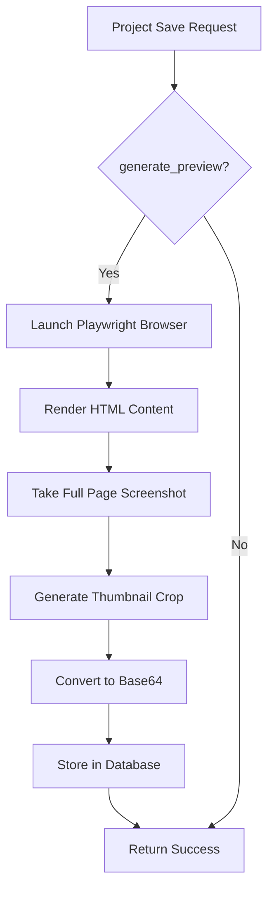

# 📸 Base64 Screenshot Preview Setup Guide

This guide explains how to set up the Base64 screenshot preview functionality for project cards.

## 🎯 Features

- **Base64 Image Storage**: Preview images stored directly in MongoDB as Base64 strings
- **Hover-to-Scroll**: Smooth vertical scrolling animation on hover
- **Automatic Generation**: Screenshots generated when projects are saved/updated
- **Responsive Design**: Clean, responsive preview cards
- **Performance Optimized**: Lazy loading and efficient image handling
- **Fallback Support**: Graceful degradation when screenshots aren't available

## 🔧 Backend Setup

### 1. Install Dependencies

```bash
cd backend

# Install Python dependencies
pip install -r requirements.txt

# Install Playwright browsers
python install_playwright.py
```

### 2. Verify Installation

```python
# Test script to verify Playwright setup
python -c "
from services.screenshot_service import screenshot_service
import asyncio

async def test():
    html = '<html><body><h1>Test</h1></body></html>'
    result = await screenshot_service.generate_base64_screenshot(html)
    print('✅ Screenshot service working!' if result else '❌ Screenshot service failed')

asyncio.run(test())
"
```

### 3. Environment Variables

Add to your `.env` file:

```env
# Screenshot settings (optional)
SCREENSHOT_WIDTH=1200
SCREENSHOT_HEIGHT=800
SCREENSHOT_QUALITY=85
```

## 🎨 Frontend Components

### ImagePreviewCard Features

- **Smart Image Loading**: Shows thumbnail first, then full image on hover
- **Smooth Animations**: 60fps scroll animations with easing
- **Progress Indicator**: Visual progress bar during scroll
- **Error Handling**: Graceful fallback for missing images
- **Performance**: Lazy loading and efficient DOM updates

### Usage Example

```tsx
import { ImagePreviewCard } from '@/components/ImagePreviewCard';

<ImagePreviewCard
  project={project}
  onPreview={handlePreview}
  onEdit={handleEdit}
  onDelete={handleDelete}
  onRename={handleRename}
  onDuplicate={handleDuplicate}
  isDropdownOpen={isDropdownOpen}
  onDropdownToggle={handleDropdownToggle}
/>
```

## 📊 Performance Characteristics

### Memory Usage (per project card)
- **Without Screenshot**: ~5KB
- **With Thumbnail**: ~15-25KB
- **With Full Preview**: ~50-100KB
- **During Hover**: +20-40KB (temporary)

### Load Times
- **Thumbnail Display**: <100ms
- **Full Image Load**: 200-500ms
- **Scroll Animation**: 2-6 seconds (content-dependent)

### Database Storage
- **Thumbnail**: ~15-30KB Base64 string
- **Full Preview**: ~80-150KB Base64 string
- **Total per Project**: ~100-180KB additional storage

## 🔄 Screenshot Generation Pipeline

### Automatic Generation
1. **Project Save**: Screenshots generated when `generate_preview=true`
2. **Content Update**: Old images deleted, new ones generated
3. **Background Processing**: Non-blocking generation with fallbacks

### Generation Process


### Fallback Strategy
1. **No Screenshot Available**: Show gradient placeholder with icon
2. **Screenshot Generation Fails**: Log error, continue without image
3. **Playwright Not Available**: Disable screenshot generation gracefully

## 🚀 Deployment Considerations

### Production Setup

```bash
# Install system dependencies (Ubuntu/Debian)
sudo apt-get update
sudo apt-get install -y \
  libnss3 \
  libxss1 \
  libasound2 \
  libxrandr2 \
  libatk1.0-0 \
  libgtk-3-0 \
  libxcomposite1 \
  libxcursor1 \
  libxdamage1 \
  libxi6 \
  libxtst6 \
  libappindicator1 \
  libnss3-dev \
  libgconf-2-4

# Install Playwright browsers in production
python -m playwright install --with-deps chromium
```

### Docker Configuration

```dockerfile
# Add to your Dockerfile
RUN pip install playwright
RUN playwright install --with-deps chromium

# Set environment variables
ENV PLAYWRIGHT_BROWSERS_PATH=/usr/local/lib/python3.11/site-packages/playwright/driver/package/.local-browsers
```

### Performance Tuning

```python
# Optimize screenshot service settings
class ScreenshotService:
    def __init__(self):
        self.browser_args = [
            '--no-sandbox',
            '--disable-setuid-sandbox',
            '--disable-dev-shm-usage',
            '--disable-gpu',
            '--disable-background-timer-throttling',
            '--disable-renderer-backgrounding',
            '--disable-backgrounding-occluded-windows',
            '--disable-features=TranslateUI',
            '--disable-ipc-flooding-protection',
            '--memory-pressure-off',
            '--renderer-process-limit=1'
        ]
```

## 🔍 Troubleshooting

### Common Issues

1. **Playwright Installation Failed**
```bash
# Manual installation
python -m playwright install chromium
python -m playwright install-deps chromium
```

2. **Screenshots Not Generating**
```python
# Check service availability
from services.screenshot_service import SCREENSHOT_AVAILABLE
print(f"Screenshot service available: {SCREENSHOT_AVAILABLE}")
```

3. **Memory Issues**
```python
# Monitor browser memory
import psutil
print(f"Memory usage: {psutil.virtual_memory().percent}%")
```

4. **Slow Screenshot Generation**
- Reduce image quality: `quality=70`
- Limit image dimensions: `width=800, height=600`
- Enable headless mode: Always enabled in production

### Debug Mode

```python
# Enable debug logging
import logging
logging.getLogger('screenshot_service').setLevel(logging.DEBUG)
```

## 📈 Scaling Considerations

### For 50+ Projects
- **Lazy Generation**: Generate screenshots on-demand
- **Background Jobs**: Use Celery/RQ for async processing
- **CDN Storage**: Move images to external storage
- **Pagination**: Limit concurrent screenshot generations

### For 100+ Projects
- **Image Compression**: Use WebP format with higher compression
- **Thumbnail-Only Mode**: Generate only thumbnails, full images on demand
- **Caching Strategy**: Redis cache for frequently accessed images
- **Queue Management**: Rate-limit screenshot generation

## ✨ Future Enhancements

- **WebP Support**: Better compression than JPEG
- **Responsive Images**: Multiple sizes for different devices
- **Video Previews**: Animated previews for interactive sites
- **Smart Cropping**: AI-powered important content detection
- **Batch Processing**: Bulk screenshot generation

## 🧪 Testing

Run the test suite:

```bash
# Test screenshot generation
python -m pytest tests/test_screenshot_service.py -v

# Test frontend components
npm test -- ImagePreviewCard

# Integration tests
python -m pytest tests/test_integration.py -v
```

---

**🎉 Setup Complete!**

 