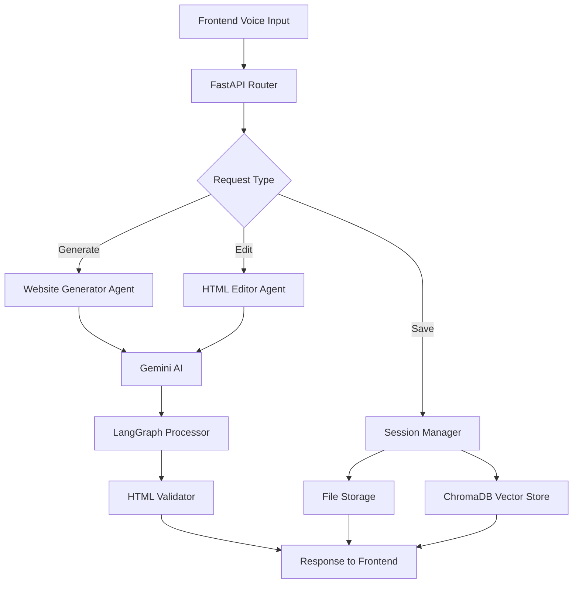

# Voice Website Generator - Backend

An AI-powered backend service for generating and editing websites using voice commands and natural language processing.

## 🎯 Purpose

This FastAPI backend serves as the intelligent engine that:
- Converts natural language prompts into complete HTML websites
- Processes voice-based editing commands to modify existing websites
- Manages user sessions and website storage
- Provides semantic search across generated content using vector embeddings

## 🛠️ Key Technologies

- **FastAPI** - High-performance API framework
- **Gemini AI** - Google's generative AI for website creation
- **LangGraph** - Agent workflow orchestration
- **ChromaDB** - Vector database for semantic search
- **BeautifulSoup** - HTML parsing and validation
- **Pydantic** - Data validation and serialization

## 🚀 Quick Setup

1. **Install dependencies**:
   ```bash
   cd backend
   python -m venv venv
   venv\Scripts\activate  # Windows
   # source venv/bin/activate  # macOS/Linux
   pip install -r requirements.txt
   ```

2. **Configure environment**:
   ```bash
   cp env_example .env
   # Edit .env and add your GEMINI_API_KEY
   ```

3. **Start the server**:
   ```bash
   python start_server.py
   # Or: uvicorn main:app --reload
   ```

4. **Access API**: http://localhost:8000/docs

## 🏗️ Architecture



## 📁 Project Structure

```
backend/
├── core/
│   └── config.py           # Environment configuration
├── services/
│   ├── website_generator.py  # AI website generation
│   ├── langgraph_agents.py   # Langgraph Agents Services
│   ├── html_editor.py        # Voice-controlled editing
│   └── session_manager.py    # Session & file management
├── main.py                 # FastAPI application
├── start_server.py         # Startup script
└── requirements.txt        # Dependencies
```

## 🔌 API Endpoints

| Endpoint | Method | Purpose |
|----------|--------|---------|
| `/generate` | POST | Generate website from prompt |
| `/edit` | POST | Edit website with voice command |
| `/save` | POST | Save website to file |
| `/undo` | POST | Undo last change |
| `/sessions/{id}/history` | GET | Get session history |

## 🧠 Agent System & Workflow

### Multi-Agent Architecture

The backend employs multiple specialized AI agents orchestrated by LangGraph:

#### 🎤 **Voice to Text Agent**
- **Purpose**: Converts audio streams to accurate text transcription
- **Technology**: Integrated with frontend Web Speech API
- **Functionality**: Handles noise reduction, accent recognition, and technical term processing

#### 🧭 **Semantic Intent Router Agent**
- **Purpose**: Analyzes user commands and determines appropriate action paths
- **Functionality**: 
  - Classifies intents (generation, editing, styling, content modification)
  - Extracts semantic meaning from natural language
  - Routes requests to appropriate specialist agents
  - Handles context switching between different command types

#### ✏️ **Contextual Editor Agent**
- **Purpose**: Intelligently modifies existing HTML/CSS based on voice commands
- **Functionality**:
  - Locates specific HTML elements using semantic understanding
  - Applies styling changes while preserving existing structure
  - Maintains design consistency and responsive behavior
  - Handles complex multi-element modifications

#### 🔍 **RAG-Enabled Response Agent**
- **Purpose**: Provides intelligent, context-aware responses and suggestions
- **Technology**: ChromaDB vector search + Gemini AI
- **Functionality**:
  - Generates helpful follow-up suggestions
  - Provides explanations of changes made
  - Offers proactive improvement recommendations
  - Maintains conversation context across sessions

#### ✅ **Validation Agent**
- **Purpose**: Ensures HTML quality, accessibility, and functionality
- **Functionality**:
  - Validates HTML syntax and structure
  - Checks CSS compliance and responsiveness
  - Scores changes for quality and user experience
  - Prevents breaking changes to website functionality

### 🔄 Complete Voice Command Processing Flow

```mermaid
graph TD
    A[🎤 Voice Command from Frontend] --> B[Voice to Text Agent]
    B --> C[📝 Transcribed Text<br/>Example: Change header color to blue]
    C --> D[Semantic Intent Router Agent]
    D --> E[🏷️ Intent Classification<br/>Tag: Style | Target: header.color=blue]
    E --> F[Contextual Editor Agent]
    F --> G[🎯 Element Location & Update<br/>Finds header block, applies blue color]
    G --> H[RAG-Enabled Response Agent]
    H --> I[💬 Intelligent Response<br/>Header changed to blue. Adjust font size too?]
    I --> J[Validation Agent]
    J --> K[✅ Quality Check<br/>Validates change, returns success score]
    K --> L[📤 Complete Response to Frontend]
    L --> M[🖥️ UI Updates<br/>Shows new header + feedback message]
    
    style A fill:#00D881
    style C fill:#2CC5A9
    style E fill:#09624C
    style G fill:#2CC5A9
    style I fill:#09624C
    style K fill:#00D881
    style M fill:#F1F7F6,color:#001B1A
```

## 🔧 Environment Variables

```env
GEMINI_API_KEY=your_api_key_here  # Required
AI_MODEL=gemini-1.5-flash
HOST=localhost
PORT=8000
DEBUG=true
```

## 📚 Documentation

- **API Docs**: http://localhost:8000/docs
- **Interactive Testing**: http://localhost:8000/redoc 