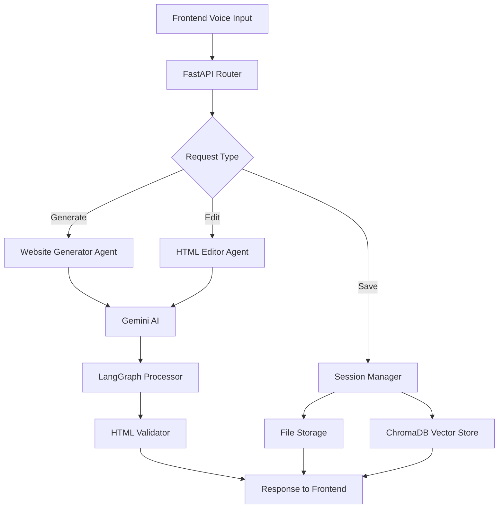

# Voice Website Generator - Backend

An AI-powered backend service for generating and editing websites using voice commands and natural language processing.

## 🎯 Purpose

This FastAPI backend serves as the intelligent engine that:
- Converts natural language prompts into complete HTML websites
- Processes voice-based editing commands to modify existing websites
- Manages user sessions and website storage
- Provides semantic search across generated content using vector embeddings

## 🛠️ Key Technologies

- **FastAPI** - High-performance API framework
- **Gemini AI** - Google's generative AI for website creation
- **LangGraph** - Agent workflow orchestration
- **ChromaDB** - Vector database for semantic search
- **BeautifulSoup** - HTML parsing and validation
- **Pydantic** - Data validation and serialization

## 🚀 Quick Setup

1. **Install dependencies**:
   ```bash
   cd backend
   python -m venv venv
   venv\Scripts\activate  # Windows
   # source venv/bin/activate  # macOS/Linux
   pip install -r requirements.txt
   ```

2. **Configure environment**:
   ```bash
   cp env_example .env
   # Edit .env and add your GEMINI_API_KEY
   ```

3. **Start the server**:
   ```bash
   python start_server.py
   # Or: uvicorn main:app --reload
   ```

4. **Access API**: http://localhost:8000/docs

## 🏗️ Architecture



## 📁 Project Structure

```
backend/
├── core/
│   └── config.py           # Environment configuration
├── services/
│   ├── website_generator.py  # AI website generation
│   ├── html_editor.py        # Voice-controlled editing
│   └── session_manager.py    # Session & file management
├── main.py                 # FastAPI application
├── start_server.py         # Startup script
└── requirements.txt        # Dependencies
```

## 🔌 API Endpoints

| Endpoint | Method | Purpose |
|----------|--------|---------|
| `/generate` | POST | Generate website from prompt |
| `/edit` | POST | Edit website with voice command |
| `/save` | POST | Save website to file |
| `/undo` | POST | Undo last change |
| `/sessions/{id}/history` | GET | Get session history |

## 🧠 Agent Workflow

The system uses LangGraph agents for intelligent processing:

1. **Input Analysis** - Processes natural language commands
2. **Content Generation** - Creates/modifies HTML using Gemini AI  
3. **Validation** - Ensures HTML quality and functionality
4. **Storage** - Saves to file system and vector database

## 🔧 Environment Variables

```env
GEMINI_API_KEY=your_api_key_here  # Required
AI_MODEL=gemini-1.5-flash
HOST=localhost
PORT=8000
DEBUG=true
```

## 📚 Documentation

- **API Docs**: http://localhost:8000/docs
- **Interactive Testing**: http://localhost:8000/redoc 