# Voice Website Generator - Frontend

A modern Next.js interface for generating and editing websites using voice commands and AI, featuring real-time preview and voice-controlled interactions.

## 🎯 Purpose

This React frontend provides an intuitive interface for:
- **Voice-to-Website Generation** - Speak your ideas to create complete websites
- **Live Voice Editing** - Modify websites in real-time using natural language
- **Visual Preview** - Instant website preview with live updates
- **Session Management** - Save, load, and manage your website projects

## 🛠️ Key Technologies

- **Next.js 15** - React framework with App Router
- **TypeScript** - Type-safe development
- **Tailwind CSS v4** - Modern utility-first styling
- **Web Speech API** - Native browser voice recognition
- **Lucide React** - Beautiful iconography
- **Custom Hooks** - Reusable voice and storage logic

## 🚀 Quick Setup

1. **Install dependencies**:
   ```bash
   cd frontend
   npm install
   ```

2. **Configure environment**:
   ```bash
   cp env_local_example .env.local
   # Edit .env.local and set NEXT_PUBLIC_API_URL=http://localhost:8000
   ```

3. **Start development server**:
   ```bash
   npm run dev
   # Or use: ./start.sh (Unix) or start.bat (Windows)
   ```

4. **Access application**: http://localhost:3000

## 🌊 User Flow

```mermaid
graph TD
    A[User Arrives] --> B[Homepage: Website Generator]
    B --> C{Input Method}
    C -->|Voice| D[🎤 Voice Recognition]
    C -->|Text| E[⌨️ Text Input]
    
    D --> F[Convert Speech to Text]
    E --> F
    F --> G[Send to Backend API]
    G --> H[AI Generates Website]
    H --> I[Display Generated Website]
    
    I --> J[Navigate to Editor]
    J --> K[Live Preview + Voice Editing]
    K --> L{Edit Commands}
    L -->|Voice| M[🎤 Speak Changes]
    L -->|Manual| N[✏️ Edit HTML Code]
    
    M --> O[Real-time Updates]
    N --> O
    O --> P[Save/Download Website]
```



## 📱 Application Pages

### Page 1: Website Generator (`/`)
- **Voice Input Button** - Click to activate speech recognition
- **Text Input Field** - Type website descriptions manually  
- **Quick Examples** - Pre-made prompts for inspiration
- **Generated Preview** - Shows AI-created website

### Page 2: Live Editor (`/editor`)
- **Live Preview Panel** - Real-time iframe display
- **Voice Edit Controls** - Microphone for voice commands
- **Code Toggle** - Switch between visual and code view
- **History Controls** - Undo/redo functionality

## 🎤 Voice Command Examples

### Generation Commands
```
"Create a modern portfolio website with dark theme"
"Build a restaurant website with online menu"
"Design a tech startup landing page"
"Make a personal blog homepage"
```

### Editing Commands
```
"Change the header color to blue"
"Make the text larger and center it"
"Add a contact form at the bottom"
"Make the buttons more rounded"
"Add animations to the navigation"
```

## 📁 Project Structure

```
frontend/
├── src/
│   ├── app/
│   │   ├── page.tsx          # Homepage (Generator)
│   │   ├── editor/
│   │   │   └── page.tsx      # Live Editor
│   │   ├── layout.tsx        # App layout
│   │   └── globals.css       # Global styles
│   ├── components/
│   │   ├── VoiceButton.tsx   # Voice recognition UI
│   │   ├── ClientOnly.tsx    # Client-side rendering
│   │   └── IntelligentResponse.tsx
│   ├── hooks/
│   │   ├── useVoiceRecognition.ts  # Voice API integration
│   │   └── useSessionStorage.ts    # Local storage management
│   └── services/
│       └── api.ts           # Backend API calls
├── public/                  # Static assets
└── .env.local.example      # Environment template
```

## 🎨 Design System

**Color Palette:**
- **Rich Black** (`#001B1A`) - Primary background
- **Bangladesh Green** (`#09624C`) - CTA buttons  
- **Caribbean Green** (`#00D881`) - Voice button, accents
- **Anti-Flash White** (`#F1F7F6`) - Text content

**Typography:** Inter font family with responsive sizing

## 🔌 Backend Integration

The frontend communicates with the Python backend via REST API:

| API Call | Purpose | Page |
|----------|---------|------|
| `POST /generate` | Create website from prompt | Generator |
| `POST /edit` | Modify website with voice | Editor |
| `POST /save` | Save website file | Editor |
| `POST /undo` | Undo last change | Editor |

## 🌐 Browser Compatibility

**Voice Recognition Support:**
- ✅ Chrome/Chromium (recommended)
- ✅ Microsoft Edge  
- ⚠️ Safari (limited functionality)
- ⚠️ Firefox (experimental)

**Fallback:** Text input available when voice recognition is unavailable

## 🔧 Environment Variables

```env
NEXT_PUBLIC_API_URL=http://localhost:8000  # Backend API URL
NEXT_PUBLIC_DEBUG=true                     # Enable debug logging
```

## 🛠️ Development Scripts

```bash
npm run dev      # Start development server
npm run build    # Build for production  
npm run start    # Start production server
npm run lint     # Run ESLint
```

## 📚 Custom Hooks

- **`useVoiceRecognition`** - Handles Web Speech API integration, error handling, and browser compatibility
- **`useSessionStorage`** - Manages local storage for session persistence and website history

---

**Need Help?** Ensure the backend is running at `http://localhost:8000` and check browser console for voice recognition permissions.
