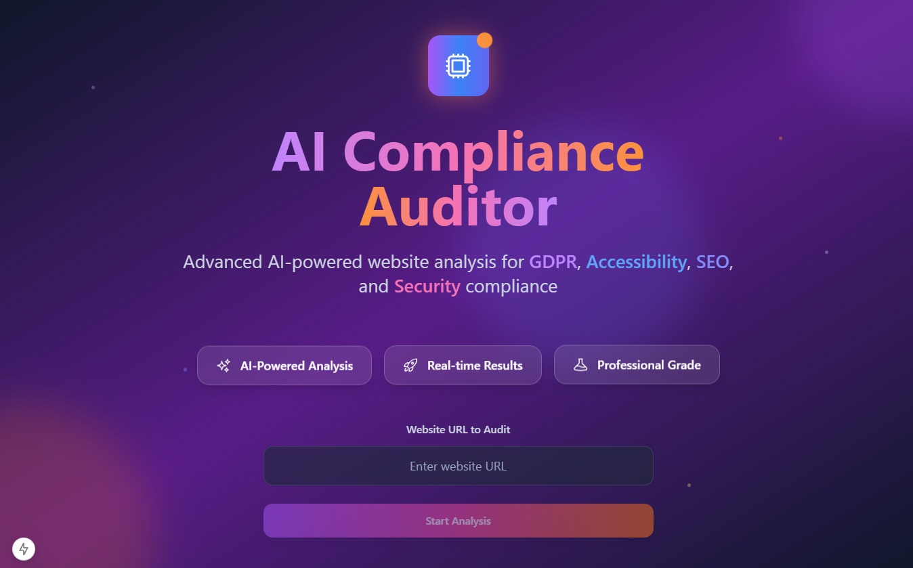
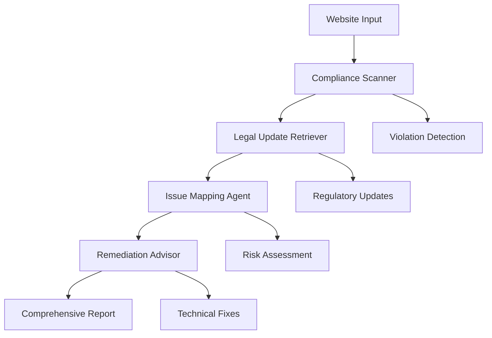

# 🤖 Multi-Agent Compliance Auditor



A sophisticated AI-powered website compliance auditing system that uses **CrewAI** to orchestrate four specialized agents for comprehensive regulatory compliance analysis.

## 🎯 Overview

The Multi-Agent Compliance Auditor introduces a revolutionary approach to website compliance checking by employing four specialized AI agents that work together sequentially to provide comprehensive, actionable compliance insights.

### 🔬 Agent Architecture



## 🚀 The Four Specialized Agents

### 1. 🔍 Compliance Scanner
**Role:** Website Compliance Scanner  
**Goal:** Thoroughly scan websites and detect compliance issues across GDPR, WCAG, ADA, and other regulations

**Capabilities:**
- GDPR requirements analysis (cookie consent, privacy policies)
- WCAG 2.1 AA standards compliance checking
- ADA digital accessibility requirements
- SEO best practices validation
- Security compliance standards

**Backstory:** Expert web accessibility and compliance scanner with deep knowledge of regulatory requirements. Methodically analyzes website structure, content, and behavior to identify all potential compliance violations.

### 2. 📚 Legal Update Retriever
**Role:** Legal Update Retriever  
**Goal:** Fetch and synthesize the latest global and regional compliance updates, regulations, and legal requirements

**Capabilities:**
- Global privacy regulations monitoring (GDPR, CCPA, PIPEDA)
- Accessibility laws tracking (ADA, Section 508, EN 301 549)
- Regional compliance variations analysis
- Recent court cases and enforcement actions
- Emerging regulatory trends identification

**Backstory:** Legal research specialist focused on digital compliance and web accessibility law. Continuously monitors legal databases, government websites, and regulatory announcements to ensure recommendations are based on current legal requirements.

### 3. 🎯 Issue Mapping Agent
**Role:** Compliance Issue Mapping Specialist  
**Goal:** Map discovered issues to specific regulations, assess severity, and prioritize violations based on legal risk

**Capabilities:**
- Technical issue to regulatory requirement mapping
- Legal risk and potential penalty assessment
- Business impact analysis
- Risk-based remediation prioritization
- Enforcement precedent correlation

**Backstory:** Compliance risk assessment expert who specializes in translating technical findings into legal and business contexts. Transforms raw compliance scan results into actionable intelligence with clear regulatory context and strategic prioritization.

### 4. 🛠️ Remediation Advisor
**Role:** Compliance Remediation Advisor  
**Goal:** Generate specific, actionable fixes including code, content, and process recommendations to achieve compliance

**Capabilities:**
- HTML, CSS, JavaScript accessibility pattern generation
- GDPR-compliant cookie management implementations
- WCAG-compliant UI component recommendations
- Privacy-by-design technical architectures
- Automated testing and monitoring solutions

**Backstory:** Technical compliance implementation expert who provides specific code examples, implementation guides, testing strategies, and maintenance recommendations. Solutions are practical, technically sound, and designed for long-term compliance sustainability.

## 📊 Multi-Agent Workflow

The agents work in **sequential coordination** using CrewAI's orchestration:

1. **Compliance Scanner** performs initial website analysis
2. **Legal Update Retriever** fetches current regulatory context
3. **Issue Mapping Agent** correlates findings with legal requirements
4. **Remediation Advisor** generates actionable implementation plans

Each agent has access to the previous agents' outputs, creating a comprehensive, context-aware analysis pipeline.

## 🛠️ Installation & Setup

### Prerequisites
- Python 3.8+
- Google Gemini API Key
- Node.js 18+ (for frontend)

### Backend Setup

1. **Install dependencies:**
```bash
cd backend
pip install -r requirements.txt
```

2. **Configure environment:**
```bash
cp env.example .env
# Edit .env with your Gemini API key
GEMINI_API_KEY=your_gemini_api_key_here
ENABLE_MULTI_AGENT=true
```

3. **Initialize ChromaDB:**
```bash
mkdir chroma_db
```

### Frontend Setup

1. **Install dependencies:**
```bash
cd frontend
npm install
```

2. **Configure environment:**
```bash
echo "NEXT_PUBLIC_ENABLE_MULTI_AGENT=true" >> .env.local
```

## 🚀 Usage

### API Endpoint
```http
POST /api/v1/audit
Content-Type: application/json

{
  "url": "https://example.com",
  "enable_ai": true,
  "enable_rag": true,
  "enable_multi_agent": true,
  "gemini_api_key": "your_api_key"
}
```

### Demo Script
```bash
cd backend
python demo_multi_agent.py --url https://example.com --api-key YOUR_GEMINI_API_KEY
```

### Frontend Interface
The frontend includes a new "Multi-Agent" tab that displays:
- Agent execution summary
- Violation reports with severity breakdown
- Legal context and regulatory updates
- Risk assessment matrix
- Remediation plans with code examples
- Implementation roadmap

## 📋 Output Structure

The multi-agent system provides comprehensive output:

```json
{
  "multi_agent_analysis": {
    "execution_summary": "Multi-agent compliance audit completed successfully",
    "agents_involved": ["Compliance Scanner", "Legal Update Retriever", "Issue Mapping Agent", "Remediation Advisor"],
    "analysis_timestamp": "2024-01-15T10:30:00Z",
    "status": "completed"
  },
  "violation_report": {
    "total_violations": 15,
    "by_category": {
      "gdpr": ["Missing cookie consent", "No privacy policy"],
      "accessibility": ["Missing alt text", "Poor color contrast"]
    },
    "severity_breakdown": {
      "critical": 3,
      "high": 7,
      "medium": 4,
      "low": 1
    }
  },
  "legal_context": {
    "recent_updates": ["GDPR enforcement updates", "WCAG 2.2 guidelines"],
    "relevant_regulations": ["GDPR Article 7", "WCAG 2.1 AA"],
    "enforcement_trends": ["Increased cookie consent penalties"]
  },
  "mapped_issues": {
    "mapped_violations": [...],
    "regulatory_citations": ["GDPR Art. 7", "WCAG 2.1 1.1.1"],
    "prioritization": ["Fix cookie consent first", "Address alt text"]
  },
  "remediation_plan": {
    "immediate_actions": ["Implement cookie banner"],
    "technical_fixes": ["Add ARIA labels"],
    "code_examples": ["<button aria-label='...'>"],
    "policy_updates": ["Update privacy policy"]
  },
  "risk_assessment": {
    "overall_risk_level": "high",
    "risk_factors": ["No GDPR compliance", "Accessibility violations"],
    "potential_penalties": ["Up to €20M GDPR fine"],
    "business_impact": "High legal and reputational risk"
  },
  "implementation_roadmap": {
    "immediate": ["Cookie consent implementation"],
    "short_term": ["Accessibility improvements"],
    "long_term": ["Compliance monitoring system"],
    "ongoing_maintenance": ["Regular compliance audits"]
  }
}
```

## 🔧 Configuration

### Environment Variables
```bash
# Multi-Agent Configuration
ENABLE_MULTI_AGENT=true
GEMINI_API_KEY=your_api_key_here
CHROMA_DB_PATH=./chroma_db

# Agent Behavior
AI_MODEL=gemini-1.5-flash
AI_TEMPERATURE=0.1
REQUEST_TIMEOUT=30
```

### Agent Customization
Each agent can be customized by modifying their configuration in `services/multi_agent_auditor.py`:

```python
# Customize agent behavior
compliance_scanner = Agent(
    role="Website Compliance Scanner",
    goal="Your custom goal",
    backstory="Your custom backstory",
    llm=self.llm,
    tools=[custom_tools]
)
```

## 📈 Performance & Scalability

### Processing Time
- **Traditional audit:** 10-15 seconds
- **Multi-agent audit:** 60-120 seconds (sequential agent execution)
- **Parallel optimization:** Available for future versions

### Resource Requirements
- **Memory:** 512MB minimum, 1GB recommended
- **Storage:** 100MB for ChromaDB
- **API Calls:** 4-8 Gemini API calls per audit

## 🔄 Integration Examples

### Python SDK
```python
from services.multi_agent_auditor import MultiAgentComplianceAuditor

auditor = MultiAgentComplianceAuditor(api_key="your_key")
results = await auditor.audit_website_with_agents(website_data)
```

### REST API
```bash
curl -X POST http://localhost:8000/api/v1/audit \
  -H "Content-Type: application/json" \
  -d '{"url": "https://example.com", "enable_multi_agent": true}'
```

### Background Processing
```python
# Update legal knowledge base
await auditor.update_legal_knowledge_base()
```

## 🛡️ Security & Privacy

- **API Key Management:** Secure environment variable storage
- **Data Privacy:** No website data stored permanently
- **Legal Compliance:** RAG system for up-to-date regulations
- **Rate Limiting:** Built-in request throttling

## 🔬 Advanced Features

### RAG Integration
The system includes a RAG (Retrieval-Augmented Generation) component that:
- Maintains updated legal knowledge base
- Provides contextual regulatory guidance
- Ensures recommendations are current

### Extensibility
- **Custom Agents:** Add specialized agents for specific regulations
- **Custom Tools:** Integrate additional scanning tools
- **Custom Workflows:** Modify agent orchestration
- **Custom Outputs:** Extend reporting formats

## 📊 Monitoring & Analytics

### Health Checks
```bash
curl http://localhost:8000/api/v1/multi-agent-status
```

### Performance Metrics
- Agent execution times
- Success/failure rates
- API usage statistics
- Compliance trend analysis

## 🤝 Contributing

We welcome contributions to enhance the multi-agent system:

1. **New Agents:** Specialized agents for specific compliance areas
2. **Tool Integration:** Additional scanning and analysis tools
3. **Workflow Optimization:** Improved agent coordination
4. **UI Enhancements:** Better visualization of multi-agent results

## 📚 Resources

- [CrewAI Documentation](https://docs.crewai.com/)
- [Google Gemini API](https://ai.google.dev/)
- [GDPR Compliance Guide](https://gdpr.eu/)
- [WCAG 2.1 Guidelines](https://www.w3.org/WAI/WCAG21/quickref/)

## 🔮 Future Roadmap

- **Parallel Agent Execution:** Reduce processing time
- **Custom Agent Marketplace:** Community-contributed agents
- **Real-time Monitoring:** Continuous compliance monitoring
- **Integration Hub:** Connect with popular CMS platforms
- **Advanced Analytics:** Compliance trend analysis and predictions

---

**🌟 The Multi-Agent Compliance Auditor represents the future of automated compliance checking, combining the power of specialized AI agents with comprehensive regulatory knowledge to deliver actionable, accurate, and up-to-date compliance insights.** 